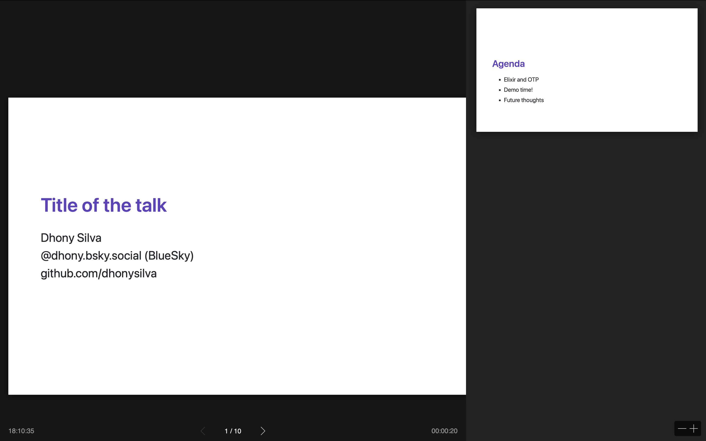

# Talks

This is a project to create Markdown files and transform it into slides presentation.

It utilizes the [Marp - Markdown Presentation Ecosystem](https://marp.app) lib to transform Markdown files into beautiful presentations.

Once you've edited your file, with the `assets/slides.md`, you can transform it into and html file, with this command:

```bash
cd assets && npm run build
```

It will return this log informing the `slides.html` has been generated into the `/priv/static/slides.html`.

```
> build
> marp slides.md -o ../priv/static/slides.html

[  INFO ] Converting 1 markdown...
[  INFO ] slides.md => ../priv/static/slides.html
```

Since the output goes to `priv/static/`, your slides are automatically served by Phoenix at:
- `http://localhost:4000/slide-01.html` (when your Phoenix server is running)

To start your Phoenix server:

* Run `mix setup` to install and setup dependencies
* Start Phoenix endpoint with `mix phx.server` or inside IEx with `iex -S mix phx.server`

Now you can visit [`localhost:4000`](http://localhost:4000) from your browser. It will redirect to the `slide.html` presentation. Feel free to navigate on it.

Here is an example of the presentation on fullscreen mode.




## What is @marp-team/marp-cli?

**Marp CLI** is a command-line interface for [Marp](https://marp.app/), which is a presentation ecosystem that allows you to create beautiful slide decks using Markdown. Key features include:

- **Markdown to Slides**: Convert Markdown files into HTML, PDF, or PowerPoint presentations
- **Custom Themes**: Support for custom CSS styling (as I can see you're already using)
- **Live Preview**: Watch mode for real-time preview during development
- **Multiple Output Formats**: Export to HTML, PDF, PPTX, PNG, JPEG
- **Marp Directives**: Special YAML frontmatter and comments for slide configuration

Here is an example on how to create a slide, provided by the official [documentation](https://marp.app):

```markdown
---
theme: gaia
_class: lead
paginate: true
backgroundColor: #fff
backgroundImage: url('https://marp.app/assets/hero-background.svg')
---


# **Marp**

Markdown Presentation Ecosystem

https://marp.app/

---

# How to write slides

Split pages by horizontal ruler (`---`). It's very simple! :satisfied:

# Slide 1

foobar

---

# Slide 2

foobar
```


### Project-local instalation

See the [package.json](assets/package.json) with our config required for this project. Run this command:

```shell
npm install
```

## Acknowledgements

This project is inspired on the [Chris Nelson](https://bsky.app/profile/superchris.launchscout.com) talking during the Wasm I/O 2025. While watching the video, I noticed the presentation was written as a Markdown file. And then I reverse engineered the repository to understand how this works.

* Chris Nelson's [YouTube presentation](https://www.youtube.com/watch?v=F-VyDJKWG_k)
* [GitHub repository](https://github.com/launchscout/wasmio_2025)
